# Hunter 사용자 가이드

**버전 1.3.0 · 한국어 · 최종 갱신 2026-09-12**

Hunter는 사내 서비스의 자산, 보안 진단, 발견 건, 개선 상태와 재검증을 연결하는 플랫폼입니다. 이 가이드는 일상적으로 사용하는 개발자, 운영 담당자, 보안 분석가와 검토자를 대상으로 합니다.

[프로젝트 소개](../index.html) · [관리자 가이드](admin-guide.html) · [HTML](user-guide.html) · [PDF](user-guide.pdf) · [전체 화면](../screenshots.html)

> 화면은 실제 Hunter 실행 화면을 사용합니다. 저장 보기·표 표시 설정·입력 오류 안내 장면은 브라우저에서 합성 API 응답 또는 저장 실패 응답을 주입한 설명용 화면입니다. 캡처에 등장하는 예시 데이터는 문서용이며 신규 설치 시 자동으로 등록되지 않습니다. 사용 권한과 관리자 설정에 따라 보이는 메뉴가 다를 수 있습니다. 에이전트 화면의 응답과 진행 이력은 로컬 SSE 모의 모델로 검증한 예시이며 실제 모델의 품질이나 취약점 탐지 성능을 나타내지 않습니다.

## 1. 시작하기

### 1.1 로그인과 버전 확인

관리자에게 받은 Hunter 주소를 브라우저에서 엽니다. 로컬 계정은 아이디와 비밀번호를 입력한 뒤 **로그인**을 선택합니다. 조직이 SSO를 설정했다면 **SSO 로그인**으로 사내 인증 화면에 이동합니다.

로그인 요청이 많으면 일시적으로 429 오류가 표시될 수 있습니다. 잠시 기다린 뒤 다시 시도하고 반복해서 실패하면 관리자에게 문의하세요.

로그인 화면에 표시된 서비스 버전을 장애 문의에 함께 적어주세요. 로그인 후에는 좌측 아래 프로필 메뉴에서도 버전을 확인할 수 있습니다. SSO 계정의 비밀번호와 다중 인증은 사내 인증 시스템에서 관리합니다.

### 1.2 메뉴 탐색

화면은 업무 메뉴, 관리자 메뉴, 개인화 메뉴로 구분됩니다. 좌측 메뉴의 현재 위치 표시로 어느 화면에 있는지 확인합니다. 주소에 메뉴 경로가 남으므로 브라우저 새로고침 후에도 같은 화면으로 돌아옵니다. 상세 화면의 경로를 북마크할 수도 있습니다. 로그인이 필요한 주소로 들어온 경우 로그인 후 해당 메뉴와 주소에 저장된 목록 조건으로 돌아갑니다.

모바일에서는 메뉴 열기 버튼으로 탐색 메뉴를 표시합니다. 넓은 표는 좌우로 스크롤할 수 있습니다. 긴 사이드바는 메뉴와 어울리는 스크롤바를 사용합니다.

| 구분 | 메뉴 | 주로 하는 일 |
| --- | --- | --- |
| 현황 | 보안 현황 | 서비스, 발견 건, 진단과 위험 현황 확인 |
| 업무 | 서비스 자산 | 소유 서비스의 URL, 환경, 조직과 담당자 관리 |
| 업무 | 발견 건 | 취약점 후보, 증거, 개선과 재검증 상태 관리 |
| 업무 | 진단 작업 | 진단 요청과 진행·완료·실패 상태 확인 |
| 업무 | 진단 예약 | 5분~7일 간격의 주기적 진단 설정 |
| 업무 | 개선 요청 | 개선 초안 작성과 외부 시스템 발송 |
| 업무 | 관계 그래프 | 서비스, 구성요소와 발견 건의 연결 확인 |
| 업무 | 권한 검증 | 역할별 합성 데이터 접근 시나리오 정의 |
| 업무 | 보고서 | 현황 확인 및 JSON·CSV 내보내기 |
| 업무 | 기여 현황 | 검토된 발견 건의 기여 점수 확인 |
| 업무 | AI 분석 도우미 | 사내 모델과 스트리밍 대화 |
| 업무 | 에이전트 진단 | 서비스별 계획·작업·도구 호출과 실시간 실행 이력 |
| 선택 | 검토·승인 | 관리자가 켠 경우에만 진단 승인·반려 |
| 개인화 | 내 프로필 | 표시 이름, 시작 화면, 로컬 비밀번호 변경 |
| 개인화 | 개인 API 키 | API·MCP 키 발급, 권한 변경, 회전, 폐기 |

### 1.3 빠른 이동과 자주 쓰는 메뉴

상단의 **빠른 이동** 버튼이나 **Ctrl+K**를 사용하면 메뉴 검색창이 열립니다. macOS에서는 **⌘+K**를 사용할 수 있습니다. 한글 메뉴명, `scan`·`mcp` 같은 영어 별칭 또는 `ㅂㅇㅎㅎ` 같은 초성으로 찾을 수 있습니다. 화살표 위·아래로 결과를 고르고 Enter로 이동하며 Esc로 닫습니다.

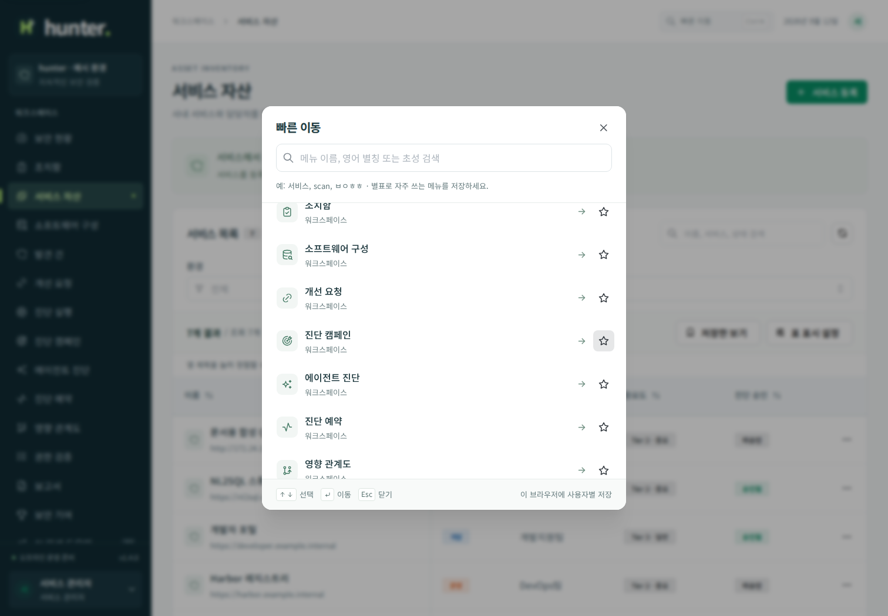

메뉴 옆 별표를 선택하면 즐겨찾기에 추가하고 다시 선택하면 해제합니다. 검색어가 없을 때 즐겨찾기와 최근 방문 메뉴를 먼저 표시합니다. 최근 방문은 같은 메뉴가 중복되지 않도록 최대 8개를 보관합니다. 메뉴 검색, 즐겨찾기와 최근 방문에는 현재 권한으로 접근할 수 있는 메뉴만 나타납니다.

즐겨찾기와 최근 방문은 **현재 브라우저에 사용자별로 저장**됩니다. 다른 브라우저나 기기로 자동 동기화되지 않으며 브라우저의 사이트 데이터를 지우면 초기화됩니다. 공용 PC에서는 사용 후 로그아웃하고 조직의 브라우저 데이터 관리 절차를 따릅니다.

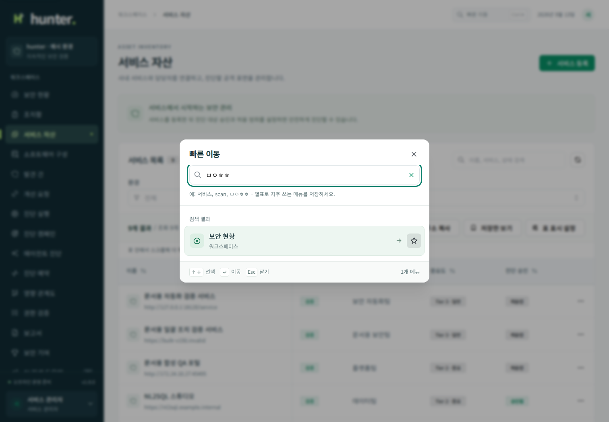

### 1.4 목록에서 항목 찾기

서비스·발견 건·진단·에이전트·사용자·개인 키·감사 기록 등의 목록은 검색, 필터, 정렬과 페이지 이동을 제공합니다. 적용할 수 있는 필터는 화면마다 다릅니다.

1. 목록 검색창에 이름, 서비스, 조직이나 화면에 보이는 상태를 입력합니다. 예를 들어 발견 건에서 `심각`, 서비스에서 `운영`을 검색할 수 있습니다. 띄어 쓴 여러 단어는 모두 포함하는 항목을 찾습니다.
2. 상태·심각도·환경·서비스 등의 필터로 범위를 좁힙니다. 검색어와 필터는 함께 적용됩니다.
3. 표의 열 제목을 선택하면 오름차순, 다시 선택하면 내림차순으로 바뀝니다. 화살표로 현재 방향을 확인합니다. 숫자는 수치 순서로, 심각도는 위험 단계 순서로 정렬합니다.
4. 목록 위에서 **결과 수 / 조회 수**를 확인합니다. 예를 들어 `8개 결과 / 조회 37개`는 현재 조회한 37개 중 조건에 맞는 항목이 8개라는 뜻입니다. 목록 아래에서는 현재 표시 범위를 확인하고 페이지를 이동합니다. **페이지당 표시 수**는 10·25·50·100개 중 선택하며 기본값은 25개입니다. 페이지가 5개를 넘으면 **이동할 페이지**에 번호를 입력하고 **이동**을 선택해 바로 갈 수 있습니다.
5. **적용 중** 영역의 조건을 선택하면 해당 검색어나 필터 하나만 해제합니다. 나머지 조건·정렬·표시 수는 유지됩니다. 전체 검색·필터·정렬·페이지·표시 수를 기본으로 돌리려면 **조건 초기화**를 선택합니다.

검색·필터·정렬·페이지·표시 수는 주소에 보존됩니다. 새로고침과 브라우저 뒤로·앞으로 이동에서도 해당 주소의 조건으로 돌아옵니다. 검색어를 입력할 때는 현재 방문 기록을 갱신하므로 글자 하나마다 뒤로가기 기록이 생기지는 않습니다. 검색·필터·정렬·표시 수를 변경하면 첫 페이지부터 확인합니다.

이 기능은 서버에서 **현재 조회한 자료 범위 안에서** 동작합니다. 화면의 페이지 이동이 서버의 전체 과거 이력을 추가 조회한다는 뜻은 아닙니다. 자료가 많다면 보고서 절의 조회 한도를 함께 확인합니다. 모바일에서는 목록 조건이 여러 줄로 배치되며 넓은 표 안을 좌우로 스크롤할 수 있습니다.

### 1.5 반복해서 쓰는 목록 보기

**저장한 보기**는 현재 검색어·필터·정렬·페이지당 표시 수를 이름과 함께 저장합니다. 예를 들어 `운영 결제 서비스`나 `심각한 확인 건`을 만들어 반복 조회에 사용할 수 있습니다.

1. 원하는 목록 조건을 정한 뒤 **저장한 보기**를 엽니다.
2. **보기 이름**을 입력하고 **현재 조건 저장**을 선택합니다. 이름은 최대 60자이고 같은 이름은 중복으로 저장할 수 없습니다.
3. 나중에 **저장한 보기**에서 이름을 선택하면 저장된 조건으로 **1페이지부터** 표시합니다. 특정 상세 항목과 이전 페이지 번호는 보기의 저장 대상이 아닙니다.
4. 휴지통 버튼으로 필요 없는 보기를 삭제합니다. 보기 삭제는 실제 서비스나 발견 건을 삭제하지 않습니다.

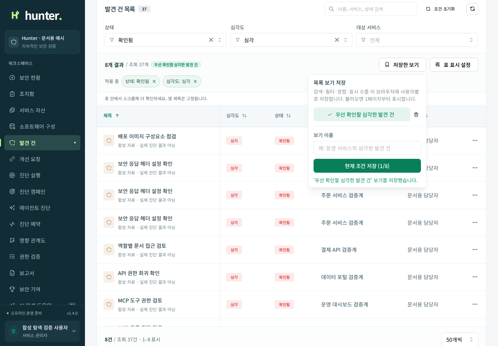

저장 보기는 **이 브라우저에서 사용자·메뉴별로 최대 8개**를 보관합니다. 발견 건에서 저장한 보기가 서비스 목록이나 다른 계정에 함께 나타나지 않습니다. 다른 브라우저·기기에 자동 동기화되지 않으며 사이트 데이터를 삭제하면 지워집니다. 브라우저 저장소를 사용할 수 없는 경우 안내가 나타나고 현재 화면에서만 적용됩니다.

적용한 저장 보기와 조건이 일치하면 결과 수 옆에 보기 이름이 나타납니다. 조건을 바꾸면 이름 표시가 사라지므로 저장본과 현재 조건을 구분할 수 있습니다. 조회는 항상 현재 계정의 권한 안에서 이루어집니다. 예전에 볼 수 있었던 서비스가 삭제되거나 권한에서 제외되면 같은 보기를 적용해도 결과가 달라질 수 있습니다.

### 1.6 긴 표 읽기와 키보드 이동

긴 표는 표 안에서 스크롤하며 읽습니다. 기본 보기에서는 세로로 이동해도 열 제목이 남습니다. 넓은 화면에서는 가로로 이동해도 첫 번째 이름·제목 열을 고정하며, 좁은 모바일 화면에서는 첫 열 고정을 해제해 다른 열을 읽을 공간을 확보합니다.

**표 표시 설정 → 행 간격 → 촘촘하게**를 선택하면 글자 크기를 유지하면서 행 여백을 줄입니다. **기본**으로 돌아오면 여유 있는 간격을 사용합니다. 이 설정도 현재 브라우저의 사용자·메뉴별로 보관됩니다.

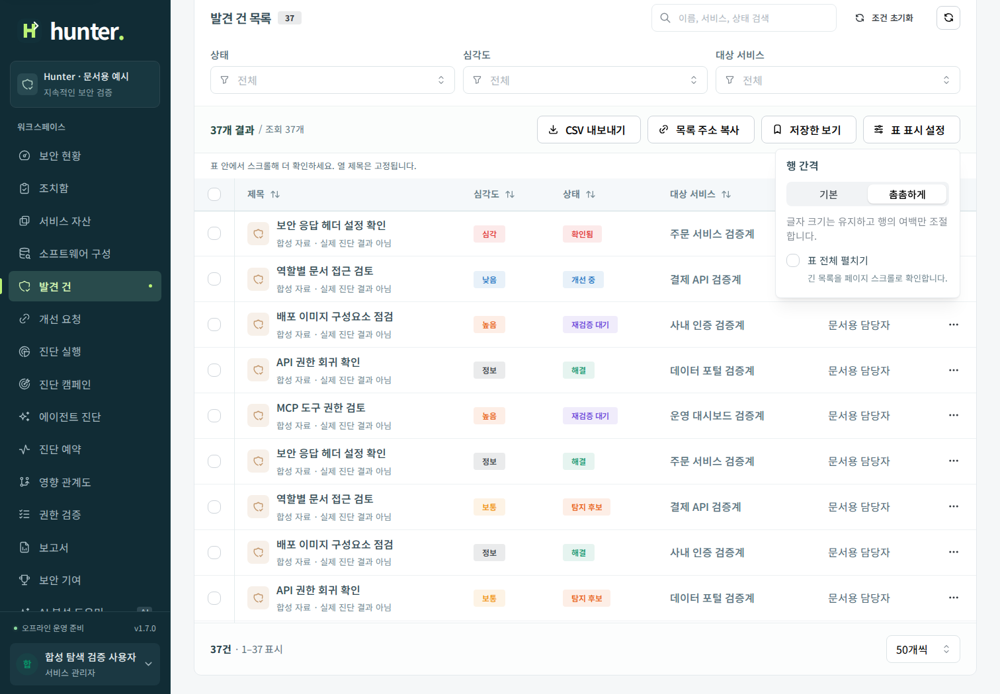

**표 전체 펼치기**를 켜면 표의 높이 제한을 없애 문서 전체를 스크롤합니다. 이 모드에서 문서를 세로로 이동할 때는 열 제목이 화면 상단에 고정되지 않습니다. 표 안 스크롤과 헤더 고정을 다시 사용하려면 해당 옵션을 끕니다.

키보드에서는 첫 Tab으로 **본문 바로가기**를 표시할 수 있습니다. 스크롤 가능한 표에 초점이 있으면 방향키로 이동하고, 열 제목의 버튼을 선택해 정렬합니다. 행에 초점이 있으면 Enter로 상세를 열 수 있습니다. 모바일 메뉴는 열린 동안 키보드 초점이 메뉴 안에 머물고 Esc로 닫으면 열기 버튼으로 돌아갑니다. 빠른 이동도 화살표·Enter·Esc를 지원합니다.

이는 제공하는 키보드 동작의 설명입니다. WCAG 인증이나 모든 보조기기 조합의 적합성을 의미하지 않습니다. 실제 검증 화면 크기와 범위는 [검증 기록](../validation.md)을 참고하세요.

### 1.7 권한을 이해하기

기능 사용 권한과 데이터 접근 범위는 함께 적용됩니다. 관리자는 전체 운영을 관리하며 팀장은 검토 업무를 수행할 수 있습니다. 일반 사용자는 자신에게 허용된 서비스와 관련 데이터를 사용합니다. 관리자 역할 설정에 따라 세부 권한은 바뀔 수 있습니다.

버튼이 없거나 접근이 거부되면 개인 API 키를 새로 만드는 것으로 권한을 늘릴 수 없습니다. 소유자 계정의 현재 권한과 키 자체에 지정한 권한의 교집합만 적용됩니다.

## 2. 보안 현황 읽기

**보안 현황**에서 등록 서비스, 열린 발견 건, 심각한 위험과 진단 이력을 확인합니다. 데이터가 없으면 빈 상태를 표시하며 임의 통계를 만들지 않습니다.

심각도와 서비스 중요도는 서로 다른 값입니다. 심각도는 개별 발견 건의 기술적 위험을, 중요도는 서비스의 업무상 우선순위를 나타냅니다. 두 값을 함께 보고 개선 우선순위를 결정하세요.

최근 발견 건에서는 제목, 대상 서비스, 심각도와 상태를 확인합니다. 최근 진단에서는 실제 실행 결과를 확인합니다. 단순히 진단이 완료되었다는 사실만으로 서비스 전체가 안전하다고 판단해서는 안 됩니다. 진단한 프로파일, 범위와 증거까지 확인합니다.

## 3. 서비스 자산 등록과 수정

1. **서비스 자산 → 서비스 등록**을 선택합니다.
2. 서비스명과 대표 URL을 입력합니다. URL은 브라우저에서 접근하는 승인 대상 주소입니다.
3. 개발계·검증계·운영계 중 환경을 선택하고 망 이름, 조직, 담당자를 입력합니다.
4. Tier 1~4 중요도, 저장소 주소, 컨테이너 이미지와 설명을 작성합니다.
5. 관련 공격 표면이 있다면 대상 목록에 등록합니다.
6. 저장 후 관리자가 서비스 진단 승인과 유효한 허용 범위를 설정했는지 확인합니다.

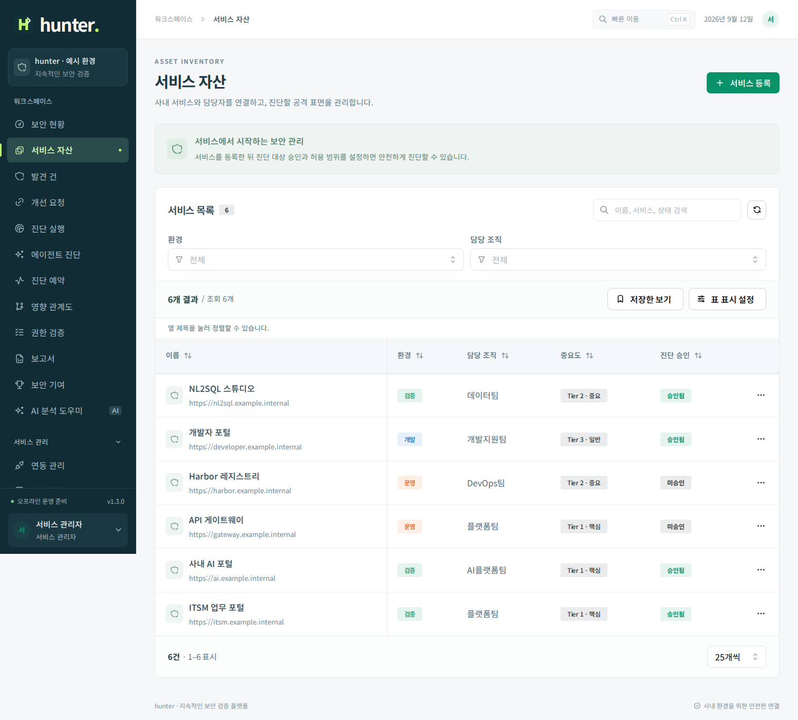

| 항목 | 입력 예시 | 의미 |
| --- | --- | --- |
| 서비스명 | 주문 API 검증계 | 조직 안에서 쉽게 구별할 수 있는 이름 |
| URL | https://orders-stg.internal | 실제 네트워크 진단의 기준 주소 |
| 환경 | 검증계 | 운영 보호 정책과 권한 시나리오 사용에 영향 |
| 망 | 개발망 | 운영 담당자가 식별할 수 있는 네트워크 구분 |
| 조직·담당자 | 주문개발팀 · 담당자명 | 대응 책임과 업무 연결 정보 |
| 중요도 | Tier 2 | 조직 정책에 따른 업무 중요도 |
| 저장소 | 사내 Git 저장소 주소 | 소스와 서비스의 관계 |
| 이미지 | harbor.internal/orders:v2.3 | 배포 구성요소 식별 |

목록에서 항목을 선택하면 상세 패널이 열리고 선택한 항목이 주소에 보존됩니다. 새로고침해도 같은 상세를 다시 표시하며 **이전 항목·다음 항목**으로 현재 검색·필터·정렬 범위의 다른 항목을 확인할 수 있습니다. 패널을 닫아도 목록 조건은 유지됩니다. 행의 작업 메뉴에서 수정할 수 있습니다. **대표 URL, 환경, 망, 조직·담당자, 중요도와 관련 대상을 변경하면 기존 서비스 진단 승인이 해제되므로 관리자가 다시 확인해야 합니다.** 자동발견으로 들어온 항목 역시 승인 전에는 진단 대상이 되지 않습니다.

### 3.1 입력 오류가 표시될 때

저장에 실패하면 폼 안에 오류 안내가 남고 입력한 내용을 유지합니다. 안내를 확인해 수정한 뒤 다시 시도하세요. 개인 프로필이나 관리자 설정에서 필수값·형식 오류가 여러 개라면 상단 요약의 항목을 선택해 해당 입력으로 이동할 수 있습니다. 모든 서버 오류에 입력 항목별 링크가 제공되는 것은 아닙니다.

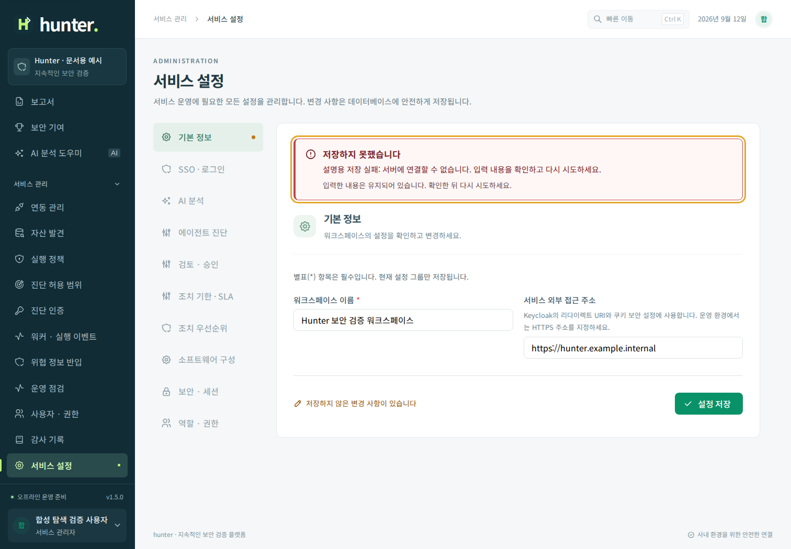

저장하지 않은 내용을 남긴 채 폼을 닫거나 다른 페이지로 이동하면 내용을 잃을 수 있습니다. 관리자 설정 그룹을 이동할 때는 별도의 미저장 안내를 제공하며, 자세한 동작은 [관리자 가이드](admin-guide.html)를 참고하세요.

## 4. 발견 건 관리

### 4.1 직접 등록

**발견 건 → 발견 건 등록**에서 대상 서비스, 제목, 심각도, 재현 조건, 증거와 개선안을 작성합니다. 비밀번호, API 키, 세션 쿠키와 고객 개인정보 원문을 증거에 붙여 넣지 마세요. 합성 테스트 식별자와 마스킹된 필요한 부분을 사용합니다.

좋은 등록 예시는 다음 정보를 포함합니다.

- 어느 서비스와 환경, 경로에서 관찰했는지
- 정상적으로 기대한 동작과 실제 동작의 차이
- 사용한 테스트 역할과 합성 데이터
- 재현에 필요한 최소 단계 및 관련 진단 번호
- 영향 범위와 확인하지 못한 부분
- 개선 담당자, 목표 기한과 제안한 수정 방향

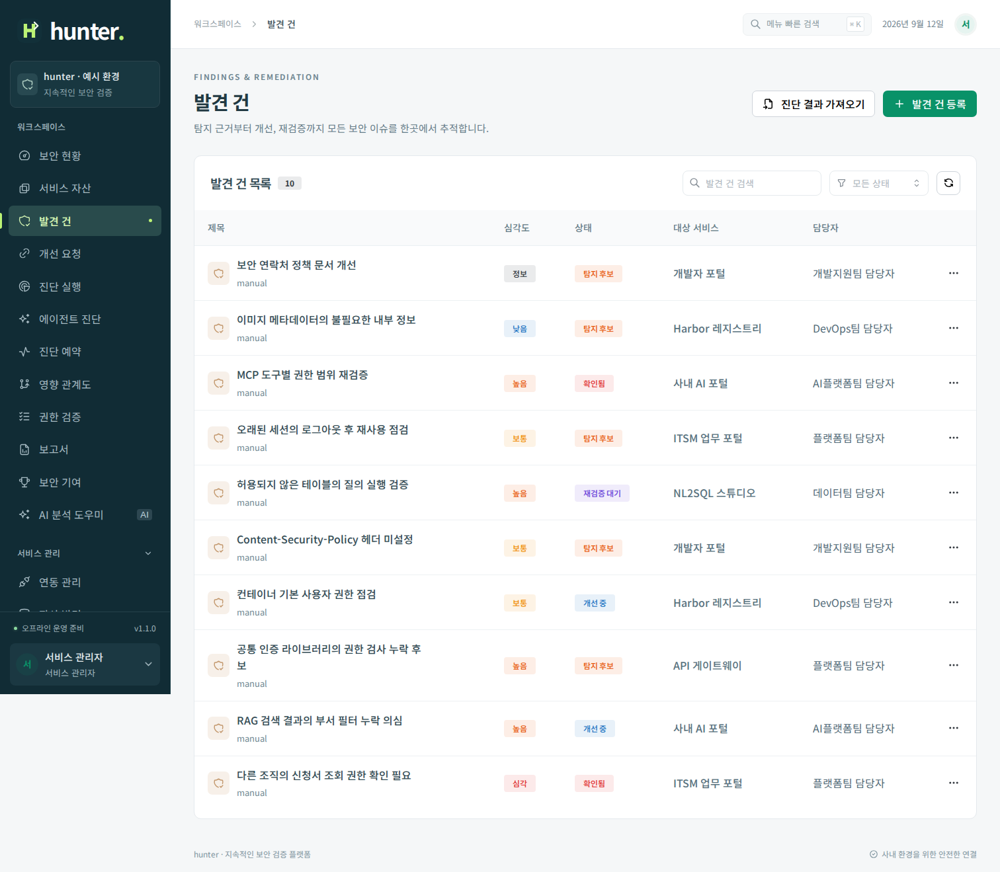

### 4.2 상태를 올바르게 사용하기

| 화면 상태 | API 값 | 사용 기준 |
| --- | --- | --- |
| 탐지 후보 | candidate | 도구 또는 사람이 발견했지만 확인이 끝나지 않음 |
| 확인됨 | confirmed | 정의된 근거와 검증 조건을 충족 |
| 개선 중 | in_progress | 담당자가 실제 수정을 진행 |
| 재검증 대기 | retest | 수정 반영 후 같은 조건의 확인을 기다림 |
| 해결 | resolved | 지원되는 재검증이 정상 완료되고 기존 문제가 해소됨 |
| 판단 불가 | inconclusive | 인증 실패, 응답 오류, 시간 초과 또는 검증 범위 부족 |
| 오탐 | false_positive | 적용 조건을 확인하여 오탐 사유를 기록 |
| 위험 수용 | accepted | 수용 사유와 유효한 만료 일시를 명시 |

**해결 상태는 일반 수정으로 지정할 수 없습니다.** 재검증에 성공한 실제 검사 결과가 필요합니다. 모든 외부 도구 결과를 자동 종결하는 범용 엔진은 제공하지 않습니다. 지원되는 헤더 재검증 범위를 넘어서는 항목은 증거를 보완하고 별도 검토 절차로 관리합니다.

오탐이나 위험 수용에는 사유가 필요합니다. 위험 수용에는 만료 일시도 입력합니다. 수용 기간이 끝나면 대시보드는 즉시 열린 위험으로 집계하고, 분 단위 유지보수 작업이 탐지 후보로 전환하여 재검토 대상으로 되돌립니다. 이 전환은 감사 기록에 남습니다. 관리자가 검토 프로세스를 켠 경우 팀장 또는 관리자가 해당 결정을 수행합니다.

### 4.3 외부 진단 결과 가져오기

**발견 건 → 진단 결과 가져오기**에서 서비스와 형식을 선택한 다음 파일 또는 JSON을 입력합니다.

| 형식 | 사용 대상 |
| --- | --- |
| generic | Hunter 형식의 발견 건 목록 |
| trivy | Trivy JSON 결과 |
| nuclei | Nuclei JSON 배열 또는 UI에서 읽는 JSONL |
| zap | ZAP JSON 보고서 |
| sarif | SARIF 2.1 결과, 예: Semgrep 결과 |
| gitleaks | Gitleaks JSON 보고서 |

가져오기는 **이미 수행한 진단 결과의 수입**입니다. Hunter 이미지 안에서 해당 외부 도구가 실행되는 것은 아닙니다. 동일한 식별 기준의 결과는 반복 관찰로 연결되며, 공통 원인 후보를 근거 없이 서로 다른 서비스의 발견 건으로 합치지 않습니다. 최초 가져온 후 표의 건수, 서비스 연결과 증거를 확인합니다.

### 4.4 개선 요청과 외부 발송

**개선 요청**에서 발견 건을 선택하고 개선 내용과 코드·설정 변경안을 작성합니다. 관리자가 준비한 발송용 REST 연동을 선택하면 사내 ITSM 티켓이나 개발 플랫폼의 PR API로 명시적으로 보낼 수 있습니다.

발송 후 외부 식별자와 주소를 확인합니다. 전송 결과가 불확실한 경우 자동 재시도하지 않으므로 외부 시스템에서 생성 여부를 먼저 확인합니다. 자동으로 코드를 병합하거나 운영 배포를 진행하지 않습니다.

## 5. 진단 요청부터 재검증까지

### 5.1 진단 전에 확인할 항목

네트워크 진단에는 관리자에게 승인받은 서비스와 유효한 진단 허용 범위가 필요합니다. 허용 호스트·경로가 요청 대상과 일치해야 하고 만료 시각이 지나지 않아야 합니다. 관리자가 팀장 검토를 꺼도 이 조건은 유지됩니다.

### 5.2 진단 요청

1. **진단 작업 → 진단 실행**을 선택합니다.
2. 서비스를 선택하고 프로파일을 선택합니다.
3. 승인된 허용 범위를 선택합니다.
4. 권한 검증 프로파일이면 연결된 시나리오를 선택합니다.
5. 진단 요청 후 작업 목록에서 상태와 결과를 확인합니다.

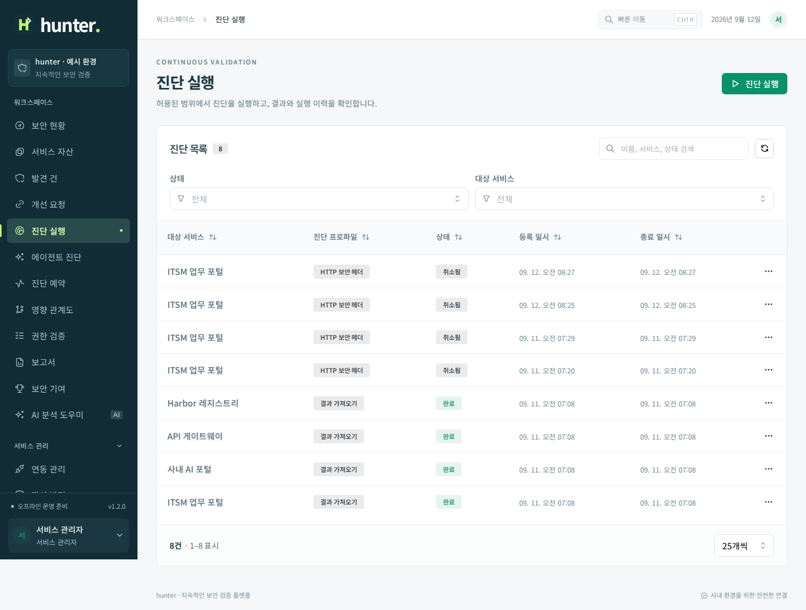

| 프로파일 | 실행 내용 | 사용 시 주의 |
| --- | --- | --- |
| HTTP 기본 진단 | 승인 주소에 제한된 요청을 보내 보안 헤더 점검 | 웹 전체 취약점 진단이나 브라우저 크롤링이 아님 |
| 업무 권한 검증 | 두 인증 프로파일로 동일 합성 데이터 접근을 비교 | 개발계·검증계의 읽기 전용 GET에 한정 |
| 결과 수입 전용 | 외부 도구 결과 연결을 위한 구분 | 네트워크 진단 엔진을 실행하지 않음 |

대기 중이면 워커 상태와 팀장 승인 여부를 확인합니다. 판단 불가나 실패가 발생하면 상세 결과에 나온 원인을 해결한 후 새로 요청합니다. 실행 중인 작업은 작업 메뉴에서 취소할 수 있습니다. 권한이 있는 관리자는 전체 긴급 중지도 사용할 수 있습니다.

### 5.3 재검증

발견 건의 수정을 반영하고 상태를 재검증 대기로 정리합니다. 관련 발견 건 식별자를 포함한 재진단은 API에서도 요청할 수 있습니다. 실제 검사 범위와 인증이 성공한 경우만 종결 판단에 사용할 수 있습니다.

~~~
POST /api/scans
{
  "service_id": "서비스 식별자",
  "profile": "http-baseline",
  "scope_id": "허용 범위 식별자",
  "finding_id": "발견 건 식별자"
}
~~~

외부 도구 결과는 새 결과 수입으로 관찰 이력을 보완합니다. 결과 파일에서 항목이 사라졌다는 이유만으로 기존 발견 건을 해결로 단정하지 않습니다.

### 5.4 주기적 진단 예약

**진단 예약 → 진단 예약 등록**에서 서비스, 프로파일, 허용 범위, 실행 간격과 첫 실행 일시를 선택합니다. 실행 간격은 5~10,080분(7일)이며 사용하지 않을 때 예약 활성화를 끕니다.

예약을 만든 시점의 승인으로 영구 실행하지 않습니다. 매 실행마다 소유자 권한, 범위 만료, 서비스 승인과 현재 정책을 다시 확인합니다. API 키로 만든 예약은 해당 키의 만료·폐기와 현재 권한도 적용합니다. 장애로 놓친 과거 실행을 대량으로 따라 실행하지 않습니다.

## 6. 관계 그래프

**관계 그래프**는 서비스와 등록된 공격 표면, 구성요소 및 발견 건의 관계를 보여줍니다. 공통 구성요소를 사용하는 서비스와 관련 발견 건을 탐색할 때 활용합니다.

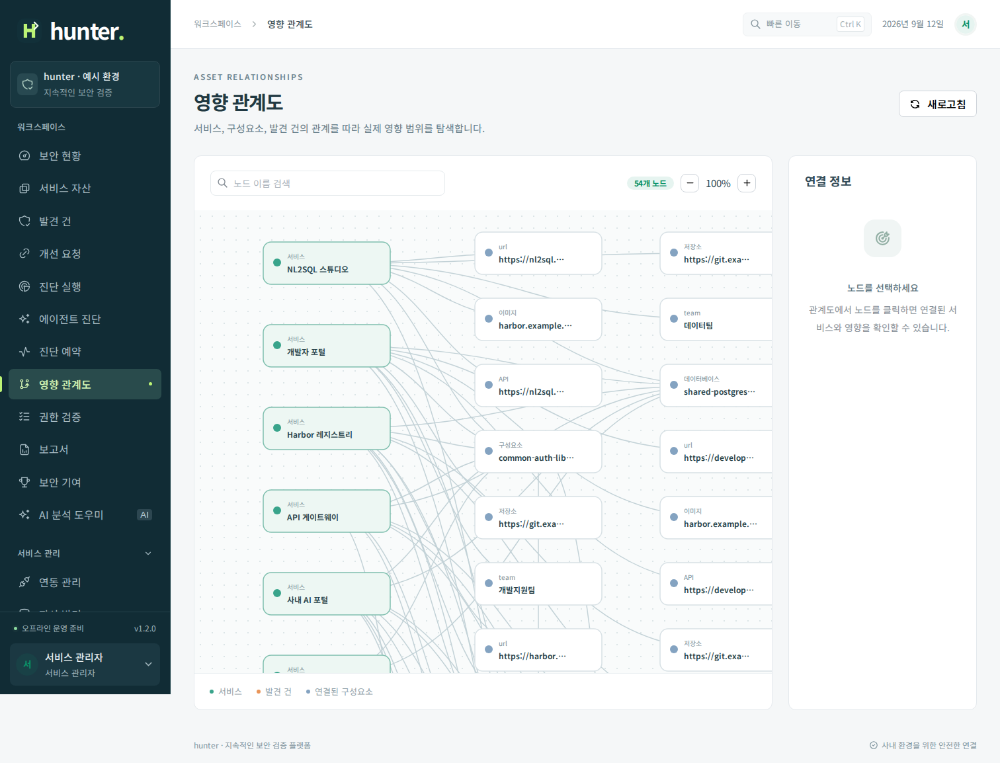

그래프는 Hunter에 등록되거나 수입된 데이터로 구성됩니다. 도달 가능한 모든 사내 호스트를 무단 탐색하여 만드는 그래프가 아닙니다. 관계가 빠졌다면 서비스의 저장소·이미지·대상 목록과 발견 건의 CVE·구성요소 정보를 보완합니다.

## 7. 업무 권한 검증 시나리오

**권한 검증**은 기대 권한을 담당자가 정의한 합성 데이터 테스트입니다. 정상 접근을 먼저 확인한 뒤 다른 역할의 노출 여부를 비교합니다.

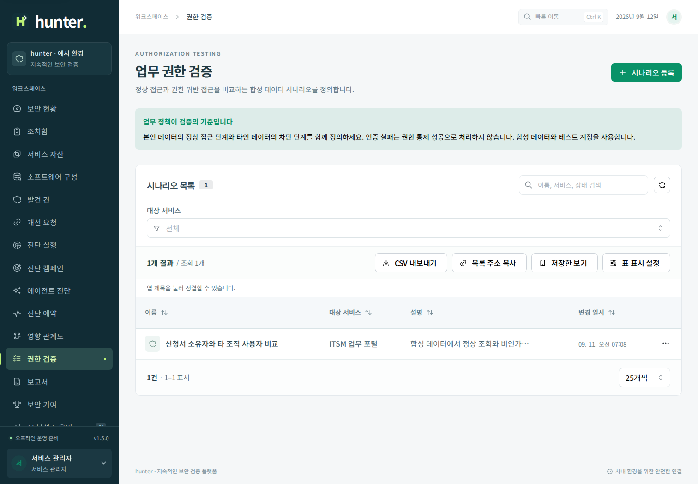

1. 개발계 또는 검증계에 합성 데이터 한 건을 준비합니다. 예: `HUNTER_TEST_ORDER_001`.
2. 이 데이터에 접근 가능한 계정과 접근하면 안 되는 별도 계정을 준비합니다.
3. 관리자에게 같은 서비스의 인증 프로파일 두 개 등록을 요청합니다.
4. 시나리오에 서비스, 읽기 전용 경로, 정상 프로파일, 비교 프로파일과 합성 식별 문자열을 입력합니다. 비교 계정이 자기 합성 데이터를 정상 조회하는 기준 경로와 기준 식별 문자열도 입력합니다.
5. 해당 경로가 허용 범위 안에 있는지 확인하고 **업무 권한 검증** 진단을 요청합니다.
6. 정상 계정의 성공과 합성 문자열 확인, 비교 계정의 응답 및 노출 여부를 함께 확인합니다.

검증은 정상 역할의 대상 조회, 비교 역할의 자기 데이터 조회, 비교 역할의 비공개 대상 조회 순서로 총 3회 GET을 수행합니다. 정상 계정이 합성 데이터를 읽지 못하거나 비교 계정의 자기 데이터 조회가 실패하면 인가 검증 성공으로 보지 않습니다. 비교 계정이 401로 인증에 실패한 경우도 판단 불가입니다. 두 계정의 인증 상태를 먼저 수정합니다. 실제 고객 데이터, 결제·삭제·승인·발송 같은 상태 변경 시나리오는 사용하지 않습니다.

## 8. 보고서와 기여 현황

### 8.1 보고서

**보고서**에서 현재 데이터를 검토하고 JSON 또는 CSV로 내보냅니다. 내보내기는 사용자가 접근 가능한 자료 범위를 따릅니다. CSV는 스프레드시트에서, JSON은 사내 분석·보고 도구에서 활용할 수 있습니다.

**담당 조직별 현황** 목록에서는 조직명 검색, 각 열 정렬과 페이지 이동을 사용할 수 있습니다. 이 검색은 조직 목록에만 적용되며 위쪽 요약 지표나 CSV·JSON 다운로드 범위를 줄이지 않습니다. 다운로드는 기존과 같이 접근 가능한 발견 건의 조회 범위를 따릅니다.

현재 버전의 목록·보고서·대시보드·관계 그래프는 접근 가능한 자료를 종류별 생성 시각 기준 최신 5,000건까지 조회·집계합니다. 자료가 이 한도를 넘으면 이전 이력이 현재 집계와 내보내기에 모두 포함되지 않으므로 전사 전체 이력 수치로 해석하지 않습니다.

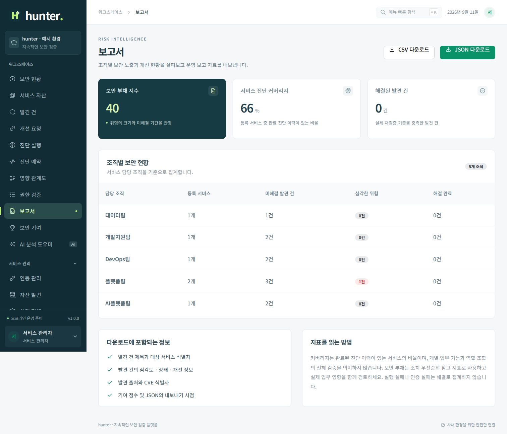

숫자를 공유할 때 서비스 범위, 기준 일시, 미검증 항목과 진단 한계를 함께 설명합니다. 등록 서비스 대비 진단 이력의 비율은 모든 기능·역할·데이터 조합을 검사한 상세 커버리지와 다릅니다.

### 8.2 기여 현황

**기여 현황**은 발견 건의 검토된 기여 점수를 모아 보여줍니다. 팀장과 관리자가 점수를 관리하며 일반 사용자가 자신의 발견 건에 임의 점수를 부여할 수 없습니다.

기여 기록은 발견 건·담당자·상태로 검색하고 심각도·인정 점수 등 열 제목으로 정렬할 수 있습니다. 기본은 인정 점수가 높은 순서입니다. 발견 건 제목을 선택하면 해당 발견 건의 상세 패널로 이동하며, 목록이 많으면 페이지를 나누어 확인합니다.

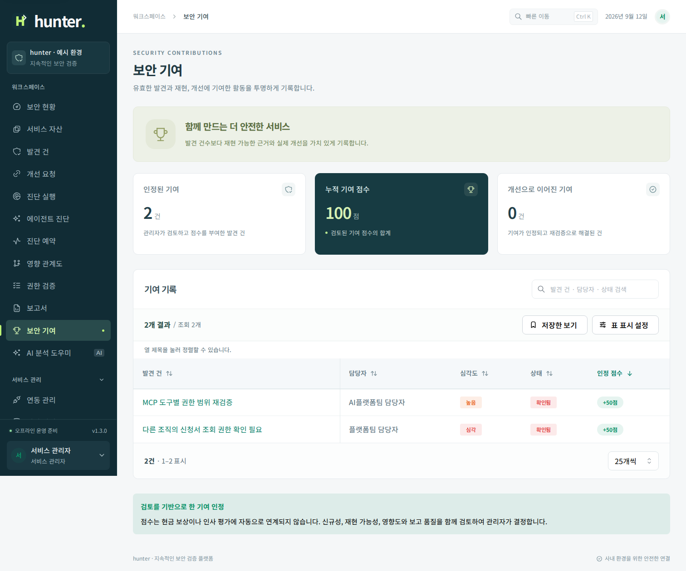

점수는 현금 보상, 급여나 인사 평가를 자동으로 확정하는 기능이 아닙니다. 조직이 정한 신고 품질, 재현 기여와 개선 지원 기준에 따라 검토 자료로 사용합니다.

## 9. AI 분석 도우미

관리자가 AI를 활성화하면 **AI 분석 도우미**를 사용할 수 있습니다. 질문을 입력하면 답변이 생성되는 대로 화면에 표시됩니다.

서버는 사용자에게 허용된 최근 서비스·발견 건의 메타데이터를 종류별 최대 100개씩 대화 맥락에 포함합니다. 비밀값과 증거 원문을 자동으로 넣지 않습니다. 질문에는 대상 서비스의 맥락, 마스킹된 증거와 알고 싶은 내용을 구체적으로 적습니다. 예: “이 헤더 점검 결과가 실제 서비스에 어떤 영향을 주는지 설명하고, Nginx 설정 수정 후 확인할 항목을 정리해 줘.”

AI 결과는 분석 제안입니다. 실제 취약점 확정, 승인, 임의 도구 호출과 자동 배포를 수행하지 않습니다. 답변의 재현 조건과 개선안은 실제 증거에 비추어 검토하세요.

긴 질문이 거부되면 입력 자료를 나누거나 출력 토큰 설정을 조정하도록 관리자에게 요청합니다. 최대 256K 설정은 모든 모델이 해당 크기를 지원한다는 의미가 아닙니다. 모델의 실제 컨텍스트와 최대 출력 한도를 함께 따라야 합니다.

## 10. 에이전트 진단

**에이전트 진단**은 등록한 서비스에 대해 목표를 계획으로 나누고, 허용된 Hunter 도구로 자료를 확인하며 진행합니다. 일반 AI 분석 도우미의 한 번의 대화보다 여러 단계의 작업이 필요한 경우에 사용합니다. 관리자가 에이전트와 AI 연결을 활성화해야 실행할 수 있습니다.

실행 기록에는 발견 건과 진단 결과가 포함될 수 있으므로, 조회에도 `agents:read`, `services:read`, `findings:read`, `scans:read` 네 권한이 모두 필요합니다. 새 실행에는 `agents:write`와 `ai:use`도 필요합니다. 개인 API 키를 사용할 때도 같은 조건과 현재 서비스 접근 권한을 적용합니다.

목록에서 목표·서비스·상태를 검색하고 상태와 서비스 필터를 함께 적용할 수 있습니다. 열 제목으로 정렬하고 페이지를 이동하여 실행을 찾습니다. 검색 조건과 페이지는 주소에 남으므로 새로고침 후에도 유지됩니다.

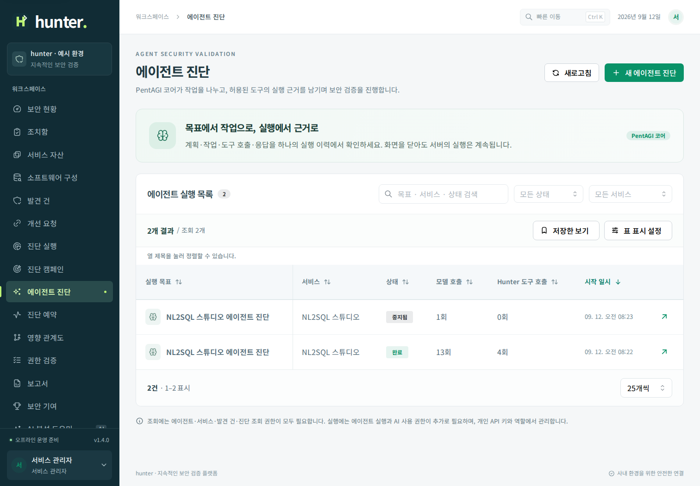

### 10.1 실행 만들기

1. **에이전트 진단** 메뉴에서 실행을 생성합니다.
2. 본인에게 허용되고 진단 승인된 서비스를 선택합니다. 진단 허용 범위를 직접 선택하거나 **유효한 범위 자동 선택**으로 둡니다. 자동 선택을 사용해도 서버가 해당 서비스의 승인·만료 조건을 검사하며, 유효한 범위가 없으면 실행할 수 없습니다. 목표는 32,000바이트 이내로 구체적으로 입력합니다. 예: “현재 미해결 발견 건을 검토하고 추가 확인이 필요한 후보와 근거를 정리해 줘.”
3. 생성한 실행의 상세 화면을 엽니다. 계획과 작업, 도구 호출 내역, 응답과 진행 이벤트를 확인합니다.
4. 도구가 실제 진단을 요청하는 경우 서비스 승인, 유효한 허용 범위, 현재 사용자·키 권한과 선택적 검토 프로세스를 통과해야 합니다.

후보 등록은 확인된 취약점의 확정이나 해결 처리가 아닙니다. 담당자는 실제 증거와 재현 조건을 검토하여 발견 건의 상태를 관리합니다. 질문에 비밀키, 고객 개인정보나 원문 인증 정보를 넣지 않습니다.

### 10.2 진행 확인·중지·다시 시도

목록 경로는 `/agents`, 상세 경로는 `/agents/실행ID`입니다. 목록은 접근 가능한 최신 1,000개 실행을 표시하며 사용자당 진행 중인 실행은 최대 3개입니다. 상세 화면의 **목표와 결과·에이전트 응답·도구 호출·실행 기록·연결된 진단** 다섯 탭에서 진행 상태를 확인합니다. 새로고침해도 같은 상세 화면과 선택한 탭으로 돌아옵니다.

**실행 기록**에서는 시간순 이벤트와 상태 전환을 확인합니다. 오류가 있으면 마지막 이벤트와 최종 상태를 함께 확인하여 원인을 구분합니다.

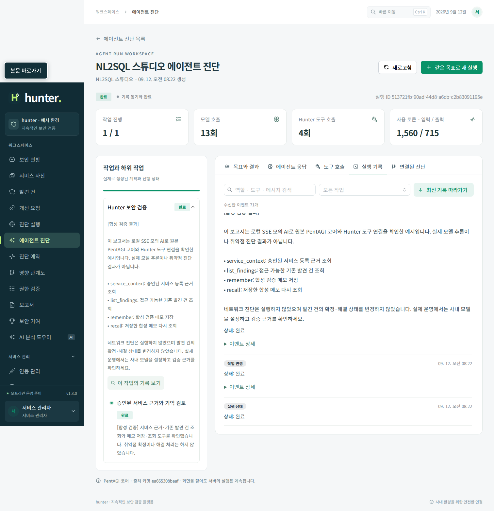

화면을 닫거나 실시간 연결이 끊겨도 서버의 실행은 계속됩니다. 연결이 복구되면 마지막 이벤트 다음부터 기록을 다시 가져옵니다. 실행을 멈추려면 **실행 중지**를 사용하고 실제 최종 상태를 확인합니다.

최대 반복 횟수는 각 역할의 원본 에이전트 대화 처리 반복에 적용합니다. 도구 호출 수는 아래 일곱 Hunter 도구의 호출을 집계하며, 내부 역할 위임은 이 도구 수에 포함하지 않습니다. 모델 호출과 전체 실행 시간에는 별도의 한도를 적용합니다.

**실행 중지**를 선택하면 해당 실행의 중단을 요청합니다. 중지는 이미 저장한 후보나 완료된 작업의 자동 취소·복원을 뜻하지 않습니다. 중지 후 목록과 상세 결과를 확인합니다. **같은 목표로 새 실행**은 이전 서비스와 목표를 복사하고 허용 범위·현재 정책을 다시 확인하여 새 실행을 만듭니다. 기존 대화 이력을 이어서 재개하지 않으며 이전 실행 이력은 유지합니다.

### 10.3 에이전트가 사용할 수 있는 도구

| 도구 기능 | 역할 |
| --- | --- |
| 서비스 조회 (`service_context`) | 해당 실행의 서비스 정보 확인 |
| 발견 건 조회 (`list_findings`) | 허용된 발견 건과 개선 상태 확인 |
| 진단 요청 (`request_scan`) | 관리자 허용과 기존 실행 통제 안에서 진단 요청 |
| 진단 결과 조회 (`scan_result`) | 요청한 진단의 상태와 결과 확인 |
| 후보 등록 (`record_candidate`) | 추가 검토할 발견 후보 저장 |
| 기억 저장 (`remember`) | 후속 작업에 활용할 맥락 저장 |
| 기억 검색 (`recall`) | 허용 범위 내 저장된 맥락 조회 |

**도구 호출** 탭에서 호출한 도구와 결과를 펼쳐 확인합니다. 도구 결과는 모델의 설명과 구분하여 확인하고, 연결된 실제 진단의 상태는 **연결된 진단** 탭에서 확인합니다.

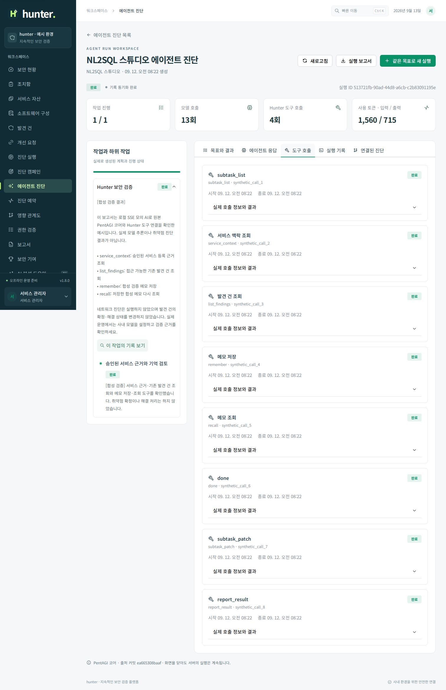

기억 기능은 관리자가 켜거나 끌 수 있습니다. 메모리는 사용자·서비스별 최대 100개를 저장하며 해당 범위에서 검색합니다. 사용자·서비스 권한을 넘어선 자료 조회 권한을 만들지 않습니다. Hunter는 이 화면에서 임의 셸·Kali 컨테이너·외부 검색을 실행하는 범용 공격 도구를 제공하지 않습니다.

## 11. 선택적 팀장 검토·승인

관리자가 **서비스 설정 → 검토·승인**을 켠 경우에만 관련 메뉴와 흐름이 나타납니다.

검토자는 요청 서비스, 프로파일, 허용 범위와 진단 목적을 확인한 후 승인 또는 반려 사유를 기록합니다. 승인하더라도 범위 만료나 긴급 중지가 발생하면 진단이 실행되지 않을 수 있습니다.

기능이 꺼져 있으면 별도 팀장 검토 단계 없이 같은 안전 정책을 거쳐 진단합니다. 승인 메뉴가 보이지 않는 것이 항상 오류는 아닙니다.

## 12. 개인화와 계정 보안

### 12.1 내 프로필

**개인화 → 내 프로필**에서 표시 이름과 기본 시작 화면을 저장합니다. 다음 로그인 시 선택한 시작 화면을 사용합니다. 로컬 비밀번호는 현재 비밀번호와 12~72바이트의 새 비밀번호를 입력하여 변경합니다.

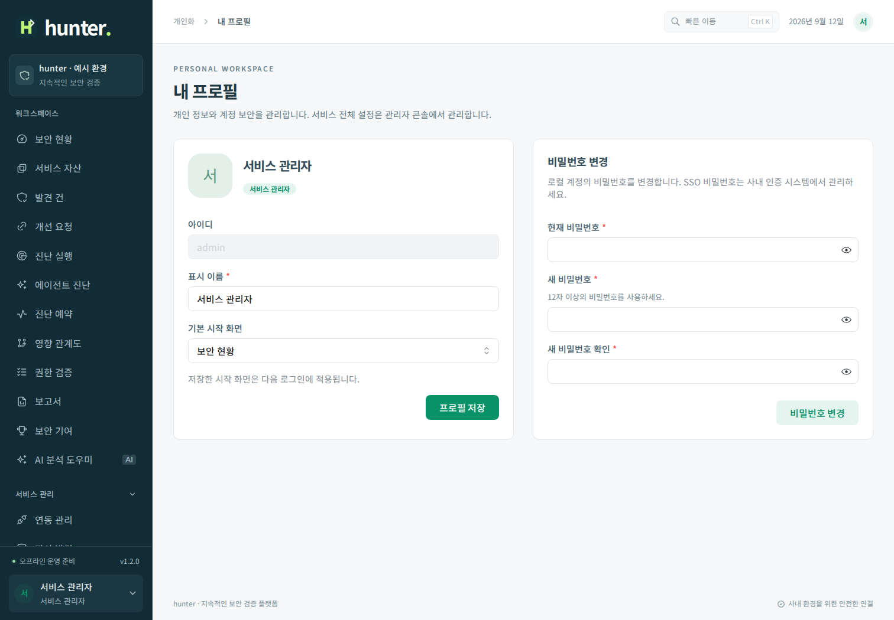

다른 메뉴를 보고 있는 중 새로고침할 때에는 저장한 시작 화면이 아니라 현재 메뉴 경로를 유지합니다. 프로필 메뉴의 서비스 버전은 운영자에게 장애를 문의할 때 활용합니다.

### 12.2 개인 API 키 발급

1. **개인화 → 개인 API 키 → 새 키 발급**을 선택합니다.
2. 사용 목적을 구분할 수 있는 이름을 입력합니다.
3. 필요한 권한만 선택합니다. 조회 연동에는 쓰기 권한을 추가하지 않습니다.
4. 관리자가 허용한 범위 안에서 유효 기간을 지정합니다.
5. 발급된 전체 키를 조직의 비밀 저장소에 보관합니다. 전체 키는 한 번만 표시됩니다.

목록에서는 키 이름·접두사·권한을 검색하고 상태와 권한으로 필터링합니다. 활성·만료·폐기 상태를 구분하고 만료 일자나 최근 사용 일시로 정렬하여 정리할 키를 찾습니다. 검색과 필터는 키 원문을 다시 보여주거나 키 권한을 변경하지 않습니다.

### 12.3 키 변경·회전·폐기

**권한 수정**은 같은 키의 이름과 권한을 변경합니다. **키 회전**은 새 토큰을 발급하고 이전 토큰을 즉시 무효화합니다. **키 폐기**는 더 이상 사용하지 않을 키를 비활성화합니다.

회전 후 연결된 API·MCP 클라이언트의 키를 즉시 교체하세요. 중단을 피해야 한다면 별도 새 키를 발급하여 연동을 전환하고 이전 키를 폐기하는 순서로 진행합니다. 서버는 키 원문 대신 해시를 보관하므로 잃어버린 키 원문을 복구할 수 없습니다.

### 12.4 API와 MCP 사용

REST API는 `Authorization: Bearer <개인 키>` 헤더를 사용합니다. 명세는 로그인한 서비스의 `/api/openapi.json`에서 확인합니다.

~~~sh
curl 'https://hunter.internal/api/services' \
  -H 'Authorization: Bearer YOUR_HUNTER_KEY'
~~~

MCP 주소는 `https://hunter.internal/mcp`이며 개인 Bearer 키를 지원하는 HTTP 클라이언트에서 연결합니다. 현재는 API 키 인증 방식이며 OAuth 동적 클라이언트 등록 방식은 아닙니다.

| MCP 도구 | 하는 일 | 필요한 권한 |
| --- | --- | --- |
| hunter_list_services | 접근 가능한 서비스 조회 | services:read |
| hunter_list_findings | 접근 가능한 발견 건 조회 | findings:read |
| hunter_request_scan | 같은 정책을 적용한 진단 요청 | scans:write |

MCP에서 진단을 요청해도 서비스 승인, 범위 제한, 팀장 승인 설정과 긴급 중지를 우회하지 않습니다.

## 13. 자주 겪는 문제

| 증상 | 확인할 사항 |
| --- | --- |
| 로그인 실패 | 아이디·비밀번호, 사용자 비활성화, 사내 OIDC 상태 |
| 메뉴가 보이지 않음 | 계정 역할 권한과 선택적 기능 활성화 여부 |
| 목록이 비어 있음 | 검색 필터, 서비스 소유 범위, 실제 등록 데이터 |
| 진단 요청 거부 | 서비스 승인, 범위 만료, 호스트·경로 일치, 긴급 중지 |
| 진단이 판단 불가 | 인증 상태, 대상 응답 오류, 시간 초과, 실제 검증 범위 |
| AI가 응답하지 않음 | 관리자 AI 활성화, 사내 모델 연결, 모델명과 토큰 한도 |
| API가 401 반환 | 키 만료·회전·폐기, 계정 비활성화 |
| API가 403 반환 | 키 권한과 계정 역할 권한, 서비스 접근 범위 |
| 새로고침 후 화면 오류 | 사용 중인 정확한 URL과 버전을 기록하여 운영자에게 전달 |

문의할 때 비밀키나 비밀번호를 보내지 말고, 발생 시각, 화면 경로, 서비스 버전, 오류 메시지와 관련 작업 식별자를 전달합니다.

## 14. 전체 화면 바로가기

[로그인](../images/login.png) · [보안 현황](../images/dashboard.png) · [서비스 자산](../images/services.png) · [발견 건](../images/findings.png) · [진단 작업](../images/scans.png) · [관계 그래프](../images/graph.png) · [권한 검증](../images/scenarios.png) · [보고서](../images/reports.png) · [기여 현황](../images/contributions.png) · [AI 도우미](../images/copilot.png) · [에이전트 진단](../images/agents.png) · [에이전트 상세](../images/agent-detail.png) · [검토·승인](../images/approvals.png) · [내 프로필](../images/personal-profile.png) · [개인 키](../images/personal-keys.png)

[관리자 운영 절차로 이동](admin-guide.html)
